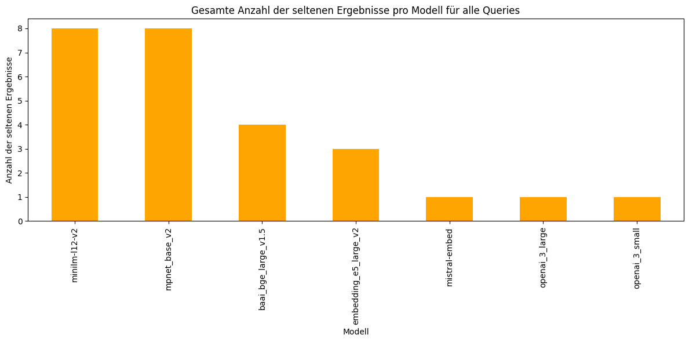
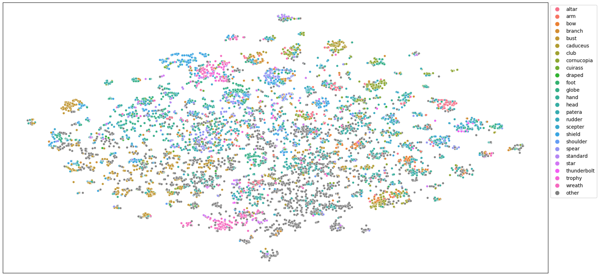

# coin description embeddings

A Jupyter notebook for calculating embeddings with different APIs, searching for terms and comparing models visually and data-driven. 

## Calculating Embeddings 
The inputs are simple coin descriptions. We pre-processed the data to get less noisy results. So we mapped verbs according to ###add_link### and replaced synonyms like Caesar -> Gaius Julius Caesar IV, Divus Julius. The embeddings are saved in dataframe / in a .feather file for further usage.

## Compare API results
We used the Modells [OPENAI-3-Small / Large](https://platform.openai.com/docs/guides/embeddings), [MiniLM-L12-v2](https://huggingface.co/sentence-transformers/all-MiniLM-L12-v2), [MPNet-Base-v2](https://huggingface.co/sentence-transformers/all-mpnet-base-v2), [Mistral-Embed](https://docs.mistral.ai/capabilities/embeddings/) [BAAI-BGE-Large-v1.5](https://huggingface.co/BAAI/bge-large-en) and [Embedding-E5-Large-v2](https://huggingface.co/intfloat/e5-large-v2).

The notebook contains several functions to compare the search results from the different APIs.

## Data driven comparison
When analysing multiple search queries and their results, some effects occur. We have noticed that some models return sparser results than others. Looking more closely at these sparse results, it cannot be said that all results are wrong, but the rate of wrong results is higher. 

## Visual comparison
The embedding space can be shown in a 2-dimensional space to get a better understanding of how it works. So we have reduced the dimension of the embeddings to 2. You can see that the models cluster descriptions around commonly used words like patera.

.
